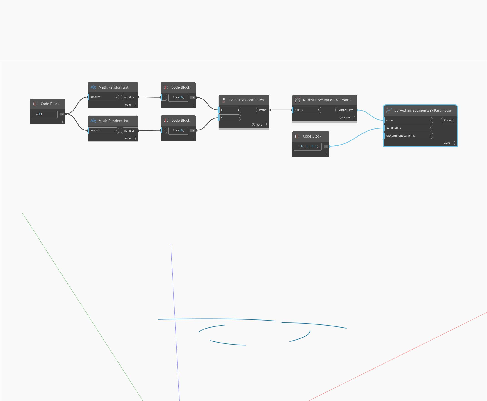

<!--- Autodesk.DesignScript.Geometry.Curve.TrimSegmentsByParameter(parameters) --->
<!--- G7Y5XS6FB4HO3WXDT5L7AR6OH54FV7RMJHVJMG2MHDHAMGF2ZVPQ --->
## 深入資訊
移除曲線的幾條線段，捨棄第 1 段、第 3 段、第 5 段...。
___
## 範例檔案

