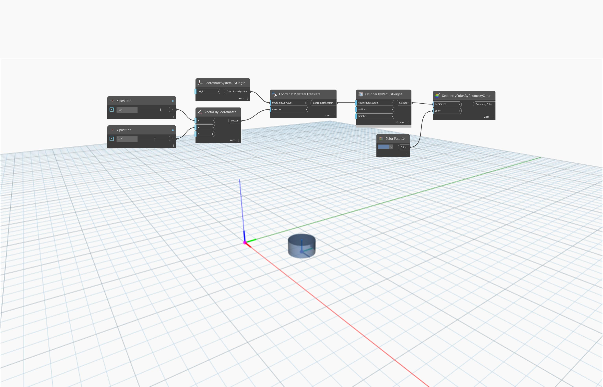

<!--- Autodesk.DesignScript.Geometry.CoordinateSystem.Translate(coordinateSystem, direction) --->
<!--- HEBF4GCPFFMBMYJFF6Z43YJXGHIM7MAZKEXMJR4UQ4BDSV22EUOA --->
## 深入資訊
`CoordinateSystem.Translate (coordinateSystem, direction)` 會傳回沿著輸入向量 (direction) 平移的新 CoordinateSystem。

在以下範例中，原點處的 CoordinateSystem 會沿著輸入向量 (3.8, 2.7, 0) 所定義的方向，平移一段距離。新的 CoordinateSystem 會透過在其上建立的圓柱來識別。

___
## 範例檔案

