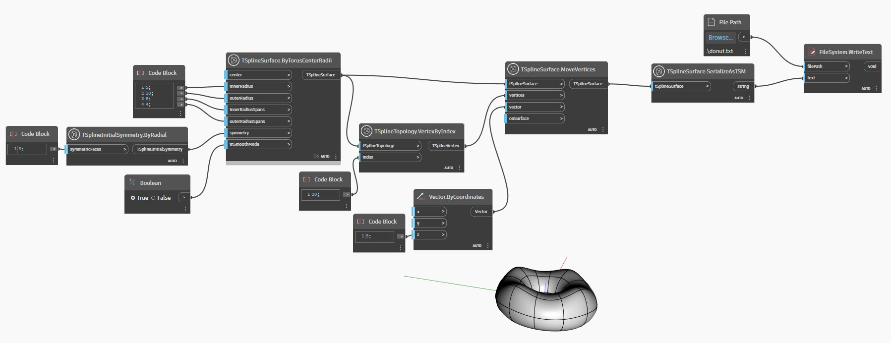

<!--- Autodesk.DesignScript.Geometry.TSpline.TSplineSurface.SerializeAsTSM --->
<!--- HPPPUZ44WSFE77XKRGFZMFM4FVPCIAERWGT6OF6U3ECKGKVBF3FA --->
## 深入資訊
以下範例使用 `TSplineSurface.SerializeAsTSM` 節點將簡單的 T 雲形線曲面轉換為字串 TSM 格式，並匯出為文字檔。稍後可以使用 `TSplineSurface.DeserializeFromTSM` 節點重新建構此檔案。
___
## 範例檔案

