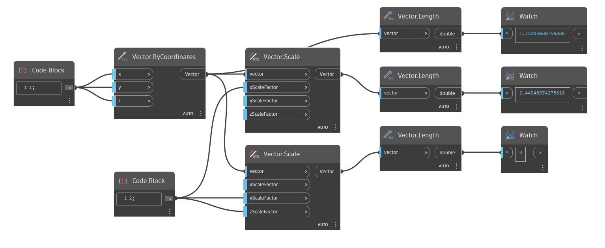

<!--- Autodesk.DesignScript.Geometry.Vector.Scale(vector, xScaleFactor, yScaleFactor, zScaleFactor) --->
<!--- JAQZIUEI4HVTL2VSANJDP5ZVTBVZCVAK3YM4PMUM7WIQ3TLZIKAQ --->
## 深入資訊
`Vector.Scale (vector, xScaleFactor, yScaleFactor, zScaleFactor)` 會傳回在 X、Y、Z 方向非等比例調整的新向量。

在以下範例中，分別從 X 比例係數和 Y/Z 比例係數調整比例而得到兩個新向量。所有給定的比例係數均為 2，但不同和/或多個方向的比例調整會傳回不同的向量長度。

___
## 範例檔案

