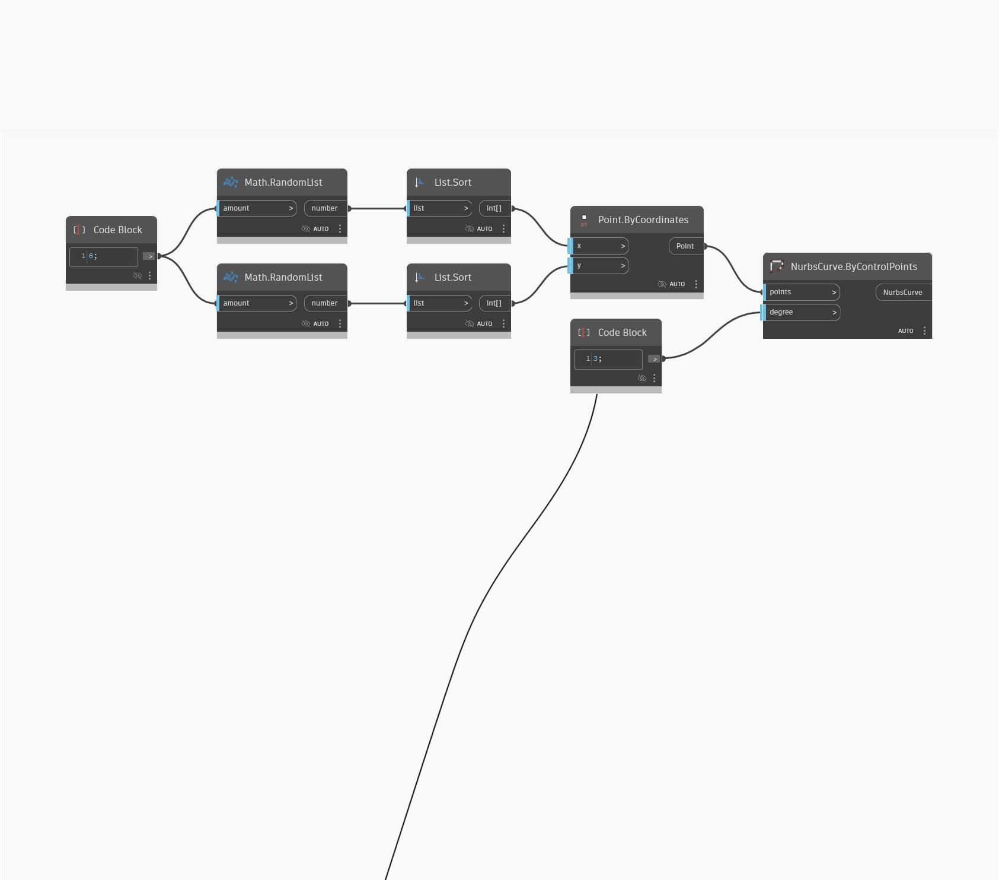

<!--- Autodesk.DesignScript.Geometry.NurbsCurve.ByControlPoints(points, degree) --->
<!--- M7MZHZHWH4ZKVKUYXLRW627FB62D73CFFTQ2Q4CDDYU24PMN4A2A --->
## 深入資訊
NurbsCurve.ByControlPoints 輸入要繪製 Nurbs 曲線的控制點清單，也能讓我們控制曲線的次數。此範例在世界 XY 平面上產生四個隨機點，並沿 X 和 Y 方向依序連接這些點。
___
## 範例檔案

