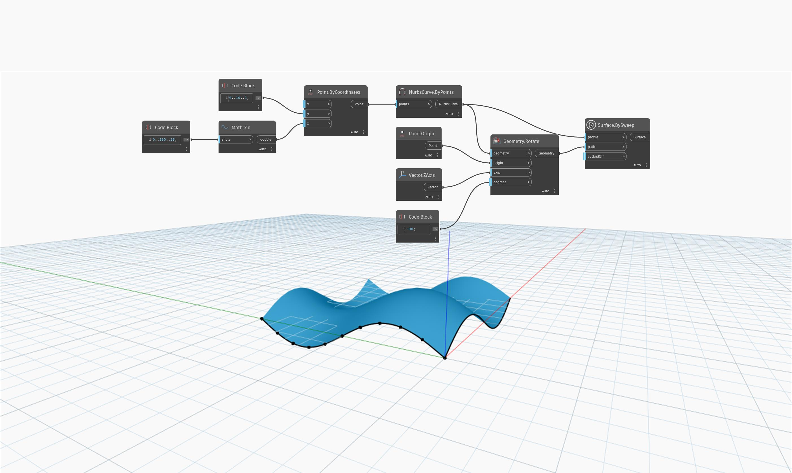

<!--- Autodesk.DesignScript.Geometry.Surface.BySweep(profile, path, cutEndOff) --->
<!--- PQ27ZE4XS2FHDBHXA6BY6FYFII5PDNG3ZXNQMB4GDZEPNQHUZH3A --->
## 深入資訊
`Surface.BySweep (profile, path, cutEndOff)` 透過沿指定路徑掃掠輸入曲線來建立曲面。`cutEndOff` 輸入控制是否要切割掃掠的終點使其垂直於路徑。

在以下範例中，我們使用 y 方向的正弦曲線作為輪廓曲線。我們將此曲線繞世界 z 軸旋轉 -90 度來作為路徑曲線。Surface.BySweep 會沿路徑曲線移動輪廓曲線而建立曲面。

___
## 範例檔案

