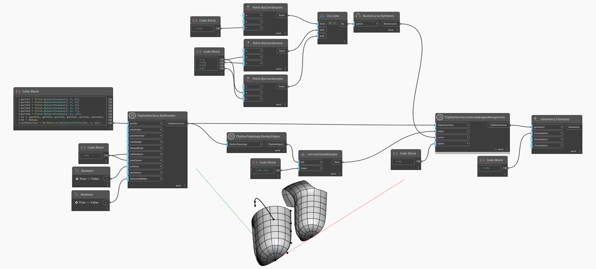

<!--- Autodesk.DesignScript.Geometry.TSpline.TSplineSurface.ExtrudeEdgesAlongCurve --->
<!--- RJA3JYUP36W2AR37ZYMWTK2ZDSFS6YXA5LMXE5CAYOZZDO6754CQ --->
## 深入資訊
以下範例選取一組 T 雲形線曲面的邊界邊，並用作 `TSplineSurface.ExtrudeEdgesAlongCurve` 節點的輸入。結果會平移到旁邊方便預覽。
___
## 範例檔案

