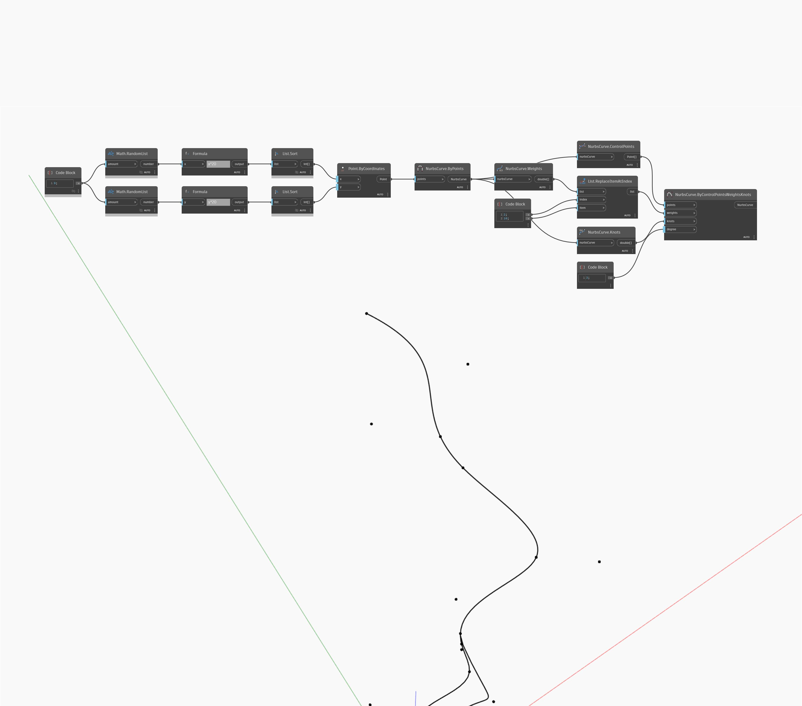

<!--- Autodesk.DesignScript.Geometry.NurbsCurve.ByControlPointsWeightsKnots --->
<!--- T6GEU2COB3ZCMHPIT6WYQEY7NOLFALMOFIPSGLNKU5GNGESBEB7Q --->
## 深入資訊
`NurbsCurve.ByControlPointsWeightsKnots` 能讓我們手動控制 NurbsCurve 的權重和節點。權重清單的長度應與控制點清單的長度相同。節點清單的大小必須等於控制點數加上次數加 1。

在以下範例中，我們先透過在一系列隨機點之間內插來建立 NurbsCurve。我們使用節點、權重和控制點來找出該曲線的對應部分。我們可以使用 `List.ReplaceItemAtIndex` 修改權重清單。最後，我們使用 `NurbsCurve.ByControlPointsWeightsKnots` 重新建立具有修改權重的 NurbsCurve。

___
## 範例檔案

