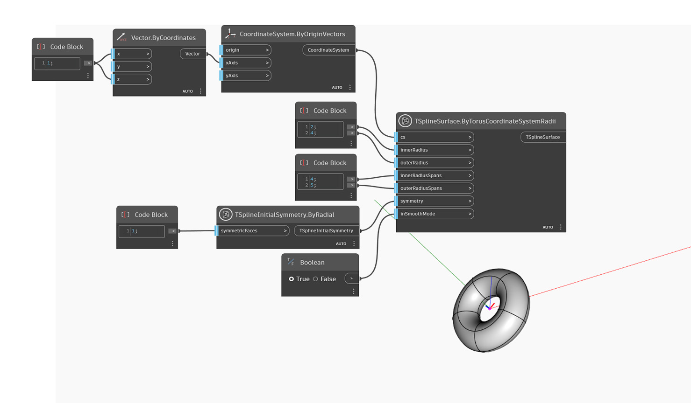

<!--- Autodesk.DesignScript.Geometry.TSpline.TSplineSurface.ByTorusCoordinateSystemRadii --->
<!--- TTAJ2WGGNFLM755ADOCD3G7N4MJBQI66CAC7SXM3XCYLEIPLBOCQ --->
## In-Depth
以下範例在給定的座標系統 `cs` 使用其原點，建立 T 雲形線圓環曲面。形狀的小半徑和大半徑由 `innerRadius` 和 `outerRadius` 輸入設定。`innerRadiusSpans` 和 `outerRadiusSpans` 的值控制沿兩個方向的曲面定義。形狀的初始對稱由 `symmetry` 輸入指定。如果套用到形狀的軸對稱是沿著 X 軸或 Y 軸，則圓環的 `outerRadiusSpans` 值必須是 4 的倍數。徑向對稱沒有此類要求。最後使用 `inSmoothMode` 輸入在 T 雲形線曲面的平滑和方塊模式預覽之間切換。

## 範例檔案

