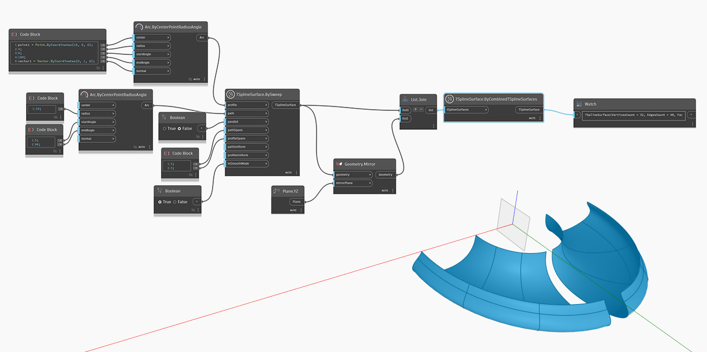

<!--- Autodesk.DesignScript.Geometry.TSpline.TSplineSurface.ByCombinedTSplineSurfaces --->
<!--- U35TWGXYHIE46AYX3QP45IXNCZJAFUT62AN4GKHWSYFDMJWZ2WZQ --->
## 深入資訊
以下範例使用對某條軸鏡射的兩個曲面建立新的 T 雲形線曲面。曲面不必接合。節點的輸出看起來有兩個拓樸不同的部分，但是為單一 T 雲形線曲面。

## 範例檔案

