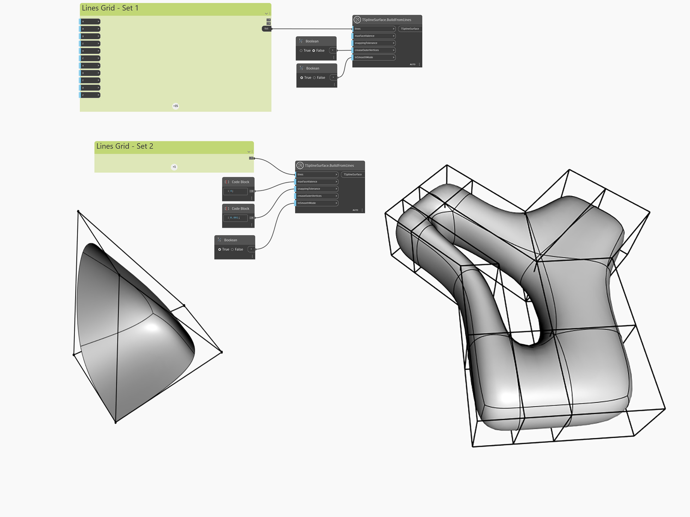

<!--- Autodesk.DesignScript.Geometry.TSpline.TSplineSurface.BuildFromLines --->
<!--- UZBX3TZTQ23FP32HELAYI7UOVGU7J6ACDZ5C3DTCYCIVJOHYWCCQ --->
## 深入資訊
`TSplineSurface.BuildFromLines` 提供建立更複雜 T 雲形線曲面的方法，產生的曲面可以當作最終的幾何圖形，也可以當作比預設基本型更接近所需形狀的自訂基本型。結果可以是封閉曲面或開放曲面，也可以有孔和/或縐摺邊。

節點的輸入是表示 T 雲形線曲面「控制框」的曲線清單。設定線清單需要一些準備，而且必須遵循某些準則。
- 線不得重疊
- 多邊形的邊界必須封閉，且線的每個端點都必須至少與另一個端點相接。線的每個交點都必須在一點相交。
- 細節越多的區域，多邊形密度必須越高
- 四邊形優於三角形和多邊形，因為更容易控制。

以下範例建立兩個 T 雲形線曲面以說明此節點的使用方式。兩種情況的 `maxFaceValence` 都保留預設值，調整 `snappingTolerance` 以確保公差值內的線被視為接合。左邊形狀的 `creaseOuterVertices` 設定為 False，讓兩個角落頂點維持銳利且不產生圓角。右邊形狀沒有外側頂點，所以此輸入保留預設值。兩個形狀都啟用 `inSmoothMode` 方便平滑預覽。

___
## 範例檔案

