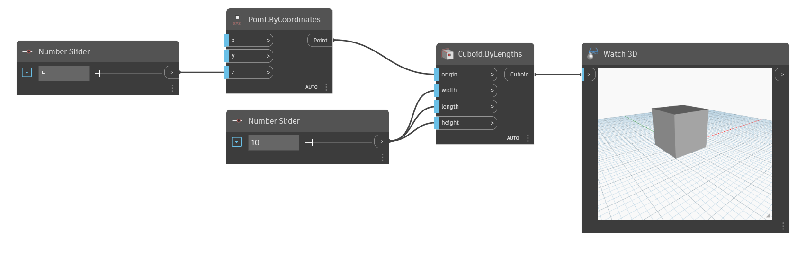

<!--- Autodesk.DesignScript.Geometry.Cuboid.ByLengths(origin, width, length, height) --->
<!--- VK63GH4YGTA23CXGPUEJO47L6TRGFRG7QY64LCFRO6C5G6UFK4PA --->
## 深入資訊
此 Cuboid.ByLengths 允許使用者輸入原點作為立方體的中心點，以及輸入立方體的長度、寬度和高度。
___
## 範例檔案

