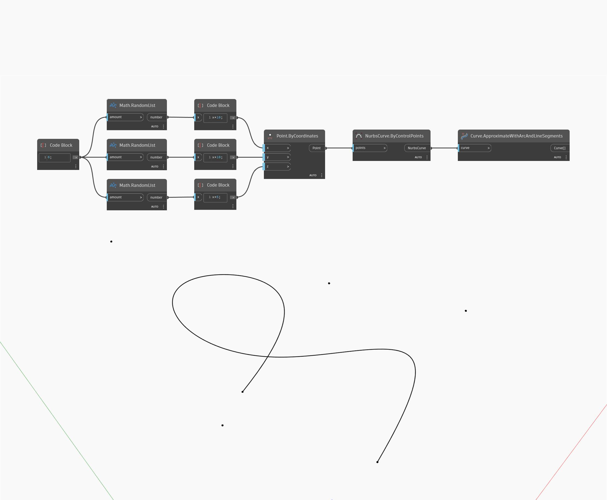

<!--- Autodesk.DesignScript.Geometry.Curve.ApproximateWithArcAndLineSegments --->
<!--- WCLH3WPRENEP5UME2OH55K7MQBNQV27U5PEFCF6YZBPO2CNXKJ2Q --->
## 深入資訊
ApproximateWithArcAndLineSegments 以曲線當作輸入，並傳回近似原始曲線的直線和弧曲線清單。在以下範例中，我們先使用 ByControlPoints 節點，以一組隨機產生的點作為輸入建立一條 Nurbs 曲線。然後使用這條曲線作為 ApproximateWithArcAndLineSegments 節點的輸入。
___
## 範例檔案

