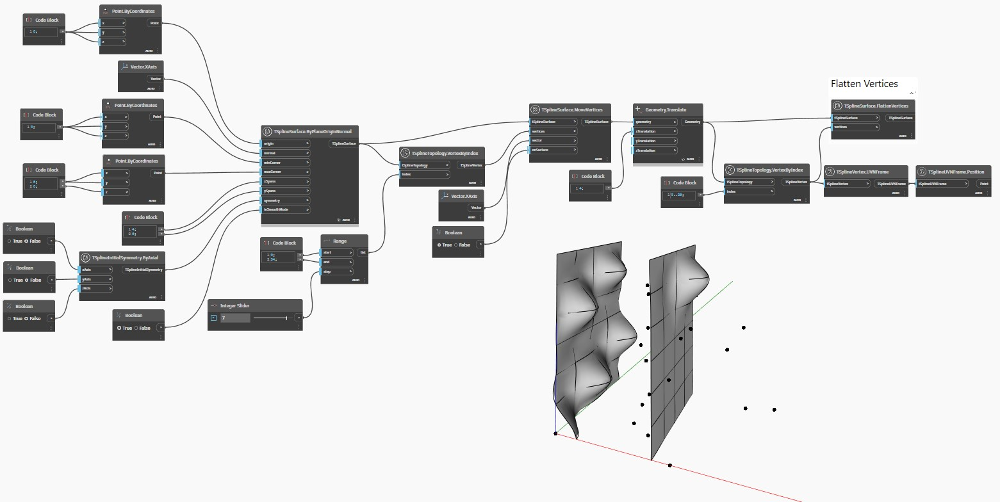

## 深入資訊
以下範例使用 `TSplineTopology.VertexByIndex` 顯示平面 T 雲形線曲面上的頂點清單。
曲面會顯示擠出的頂點，然後使用 `TSplineSurface.FlattenVertices(vertices)` 節點展開其中某些頂點。
使用 `TSplineVertex.UVNFrame` 和 `TSplineUVNFrame.Position` 節點亮顯要展開的頂點。
___
## 範例檔案

