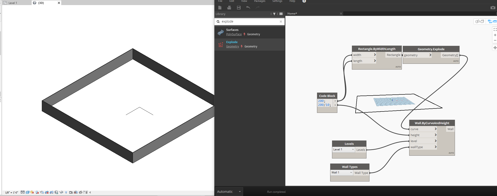
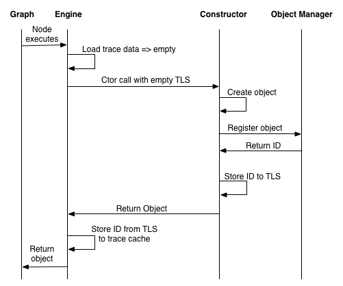
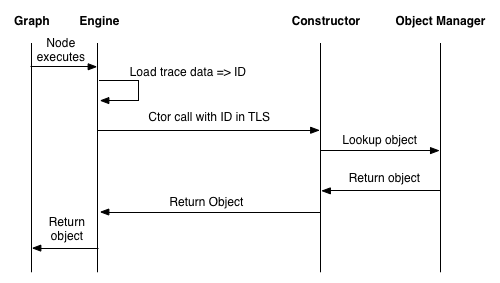
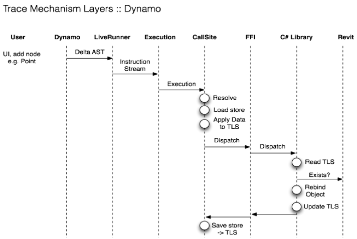
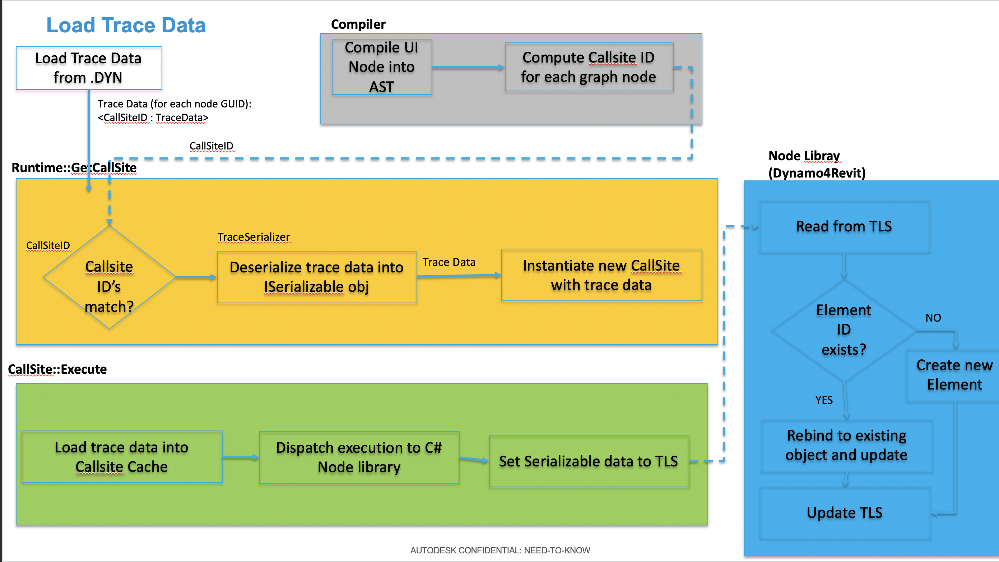

## Element Binding and Trace

#### overview

*Trace* is a mechanism in Dynamo core, that is capable of serializing data into the .dyn (dynamo file). Crucially, this data is keyed to the call-sites of nodes within the dynamo graph.

When a Dynamo graph is opened from disk, the trace data saved therein is re-associated with the nodes of the graph.

#### glossary:
* Trace mechanism:
    
  * Implements Element Binding in Dynamo
  * The trace mechanism can be used to ensure that objects are rebound to geometry that they created
  * The Callsite and trace mechanism handle providing a persistent GUID that the node implementor can use for relinking

* Callsite

  * The executable contains multiple callsites. These callsites are used to dispatch execution to the various places where they need to be dispatched from:
    * C# library
    * Built-in method
    * DesignScript function
    * Custom node (DS function)

* TraceSerializer
  * Serializes `ISerializable` and `[Serializable]` marked classes into trace.
  * Handles serialization and deserialization of data into trace.
  * TraceBinder controls binding deserialized data to a runtime type. (creates instance of real class)

#### what does it look like?
----

Trace data is serialized into the .dyn file inside a property called Bindings. This is an array of callsites-ids -> data. A callsite is the particular location/instance where a node is called in the designscript virtual machine. It's worth mentioning that nodes in a dynamo graph may be called multiple times and thus multiple callsites might be created for a single node instance.

```json
"Bindings": [
    {
      "NodeId": "1e83cc25-7de6-4a7c-a702-600b79aa194d",
      "Binding": {
        "WrapperObject_InClassDecl-1_InFunctionScope-1_Instance0_1e83cc25-7de6-4a7c-a702-600b79aa194d":  "Base64 Encoded Data"
      }
    },
    {
      "NodeId": "c69c7bec-d54b-4ead-aea8-a3f45bea9ab2",
      "Binding": {
        "WrapperObject_InClassDecl-1_InFunctionScope-1_Instance0_c69c7bec-d54b-4ead-aea8-a3f45bea9ab2": "Base64 Encoded Data"
      }
    }
  ],

 
```

 it is *NOT* advisable to depend on the format of the serialized base64encoded data.


#### what problem are we trying to solve.
----


There are many reasons why one would want to save arbitrary data as a result of a function execution, but in this case trace was developed to solve a specific problem that users encounter frequently as they build and iterate on software programs that create elements in host applications.

The problem is one we have called `Element Binding` and the idea is this:

As a user develops and runs a Dynamo graph they will likely be generating new elements in the host application model. For our example
let's say the user has a small program that generates 100 doors in an architectural model. The number and location of these doors is controlled by their program.

The first time the user runs the program, it generates these 100 doors.

Later when the user modifies an input to their program, and re-executes it - their program will *(without element binding)* create 100 new doors, the old doors will still exist in the model along with the new ones.

----

Because Dynamo is a live programming environment and features an `"Automatic"` run mode where changes to the graph trigger a new execution this can quickly clutter a model with the results of many program runs.


We have found this is not usually what users expect, instead with element binding enabled the previous results of a graph execution are cleaned up and deleted or modified. Which one (*delete or modified*) depends on the flexibility of your host's API. With element binding enabled, after the second, third, or 50th run of the user's dynamo program - there are only 100 doors in the model.

This requires more than just being able to serialize data into the .dyn file - and as you will see below there are mechanisms in DynamoRevit built on top of trace to support these rebinding workflows.

----

This is an appropriate time to mention the other important use case of element binding for hosts like Revit. Because elements that were created when element binding was enabled will attempt to keep the existing element IDs (modify existing elements) - logic which was built on top of these elements in the host application will continue to exist after a dynamo program is run. For example:

Let's return to our architectural model example.

Let's run through an example first with element binding disabled - This time the user has a program that generates some architectural walls.

 They run their program, and it generates some walls in the host application. They then leave the dynamo graph, and use normal Revit tools to place some windows into those walls. The windows are bound to these specific walls as part of the Revit model.

The user starts Dynamo back up and runs the graph again - now, like in our last example, they have two sets of walls. The first set has the windows added to it, but the new walls do not.

If element binding had been enabled we can retain the existing work that was done manually in the host application without Dynamo. For example, if binding was enabled when the user ran their program the second time, the walls would be modified, not deleted, and the downstream changes made in the host application would persist. The model would contain walls with windows - instead of two sets of walls in various states.

-----




#### element binding compared to trace
----

Trace is a mechanism in dynamo core - it utilizes a static variable of callsites to data to map your data to the callsite of a function in the graph, as described above.

It also allows you to serialize arbitrary data into the .dyn file when writing zero touch dynamo nodes. This is not generally advisable as it means the potentially transferable zero touch code now has a dependency on dynamo core.

Do not rely on the serialized format of the data in the .dyn file - instead use the [Serializable] attribute and interface

ElementBinding on the other hand is a built on top of the trace apis and is implemented in the dynamo integration *(DynamoRevit Dynamo4Civil etc.)*


#### Trace APIs
some of the low level Trace APIs worth knowing about are:

``` c#
public static ISerializable GetTraceData(string key)
///Returns the data that is bound to a particular key

public static void SetTraceData(string key, ISerializable value)
///Set the data bound to a particular key
```

you can see these used in the example below

to interact with the trace data that Dynamo has loaded from an existing file or is generating 
you can look at:

```c#
 public IDictionary<Guid, List<CallSite.RawTraceData>> 
 GetTraceDataForNodes(IEnumerable<Guid> nodeGuids, Executable executable)
```
[GetTraceDataForNodes](https://github.com/DynamoDS/Dynamo/blob/master/src/Engine/ProtoCore/RuntimeData.cs#L218)

[RuntimeTrace.cs](https://github.com/DynamoDS/Dynamo/blob/master/src/Engine/ProtoCore/RuntimeData.cs)


#### simple Trace example from a node
----
An example of a Dynamo node which uses trace directly is provided here in the [DynamoSamples repo](https://github.com/DynamoDS/DynamoSamples/blob/master/src/SampleLibraryZeroTouch/Examples/TraceExample.cs)

The summary of the class there explains the gist of what trace is all about:

```
  /*
     * After a graph update, Dynamo typically disposes of all
     * objects created during the graph update. But what if there are 
     * objects which are expensive to re-create, or which have other
     * associations in a host application? You wouldn't want those those objects
     * re-created on every graph update. For example, you might 
     * have an external database whose records contain data which needs
     * to be re-applied to an object when it is created in Dynamo.
     * In this example, we use a wrapper class, TraceExampleWrapper, to create 
     * TraceExampleItem objects which are stored in a static dictionary 
     * (they could be stored in a database as well). On subsequent graph updates, 
     * the objects will be retrieved from the data store using a trace id stored 
     * in the trace cache.
     */
```

This example uses the trace apis in DynamoCore directly to store some data whenever a particular node executes. In this case a dictionary plays the part of the host application model - like Revit's model database.

The rough setup is:

A static util class `TraceExampleWrapper` is imported as a node into Dynamo. 
it contains a single method `ByString` which creates `TraceExampleItem` - These are regular .net objects which contain a `description` property.

Each `TraceExampleItem` is serialized into trace represented as a `TraceableId` - this is just a class containing an `IntId` which is marked `[Serializeable]` so it can be serialized with `SOAP` Formatter.
see [here for more info on the serializable attribute](https://docs.microsoft.com/en-us/dotnet/api/system.serializableattribute?view=netframework-4.8)

You must also implement the `ISerializable` interface defined [here](https://docs.microsoft.com/en-us/dotnet/api/system.runtime.serialization.iserializable?view=netframework-4.8)


``` c#
    [IsVisibleInDynamoLibrary(false)]
    [Serializable]
    public class TraceableId : ISerializable
    {
    }
```

This class is created for each `TraceExampleItem` we wish to save into trace, serialized, base64encoded and saved to disk when the graph is saved so that bindings can be re-associated, even later when the graph is opened back up on top of an existing dictionary of elements. That won't work well in the case of this example since the dictionary is not really persistent like a Revit document is.

Finally the last part of the equation is the `TraceableObjectManager`, which is similar to the `ElementBinder` in `DynamoRevit` - this manages the relationship between the objects present in the host's document model and the data we have stored in dynamo trace.

When a user runs a graph containing the `TraceExampleWrapper.ByString` node for the first time a new `TraceableId` is created with a new id, the `TraceExampleItem` is stored in the dictionary mapped to that new ID, and we store the `TraceableID` in trace.

On the next run of the graph - we look in trace, find the ID we stored there, find the object mapped to that ID, and return that object! Instead of creating a brand new object, we modify the existing one.

The flow of two consecutive executions of graph that creates a single `TraceExampleItem` looks like this:





The same idea is illustrated in the next example with a more realistic DynamoRevit node use case.

#### Trace Diagram




#### NOTE :
in recent versions of Dynamo TLS(thread local storage) use has been replaced with static member use.

#### Element binding implementation example

-----
Let's quickly take a look at what a node that is using element binding looks like when implemented for DynamoRevit, this is analogous to the type of node used above in the given wall creation examples.


---


``` c#
    private void InitWall(Curve curve, Autodesk.Revit.DB.WallType wallType, Autodesk.Revit.DB.Level baseLevel, double height, double offset, bool flip, bool isStructural)
        {
            // This creates a new wall and deletes the old one
            TransactionManager.Instance.EnsureInTransaction(Document);

            //Phase 1 - Check to see if the object exists and should be rebound
            var wallElem =
                ElementBinder.GetElementFromTrace<Autodesk.Revit.DB.Wall>(Document);

            bool successfullyUsedExistingWall = false;
            //There was a modelcurve, try and set sketch plane
            // if you can't, rebuild 
            if (wallElem != null && wallElem.Location is Autodesk.Revit.DB.LocationCurve)
            {
                var wallLocation = wallElem.Location as Autodesk.Revit.DB.LocationCurve;
                <SNIP>

                    if(!CurveUtils.CurvesAreSimilar(wallLocation.Curve, curve))
                        wallLocation.Curve = curve;

                  <SNIP>
                
            }

            var wall = successfullyUsedExistingWall ? wallElem :
                     Autodesk.Revit.DB.Wall.Create(Document, curve, wallType.Id, baseLevel.Id, height, offset, flip, isStructural);
            InternalSetWall(wall);

            TransactionManager.Instance.TransactionTaskDone();

            // delete the element stored in trace and add this new one
            ElementBinder.CleanupAndSetElementForTrace(Document, InternalWall);
        }
```

The above code illustrates a sample constructor for a wall element - this constructor would be called from a node in dynamo like:
`Wall.byParams`

The important phases of the constructor's execution as they relate to element binding are:

1. use the `elementBinder` to check if there are any previously created objects which were bound to this callsite in a past run.
`ElementBinder.GetElementFromTrace<Autodesk.Revit.DB.Wall>`
2. if so ,then try to modify that wall instead of creating a new one.

```c#
 if(!CurveUtils.CurvesAreSimilar(wallLocation.Curve, curve))
                        wallLocation.Curve = curve;
```

3. else create a new a wall.
```c#
  var wall = successfullyUsedExistingWall ? wallElem :
                     Autodesk.Revit.DB.Wall.Create(Document, curve, wallType.Id, baseLevel.Id, height, offset, flip, isStructural);
                     
```

4. delete the old element we just retrieved from trace, and add our new one so we can look up this element in the future:
```c#
 ElementBinder.CleanupAndSetElementForTrace(Document, InternalWall);
```

### Discussion

#### Efficiency
* Currently each serialize trace object is serialized using SOAP xml formatting - this is quite verbose and duplicates a lot of information. Then the data is base64 encoded twice - This is not efficent in terms of serialization or deserialization. This can be improved in the future if the internal format is not built on top of. Again, we repeat, do not rely on the format of the serialized data at rest.

#### Should ElementBinding be on by default?
* There are use cases where element binding is not desired. What if one is an advanced dynamo user developing a program which should be run multiple times to generate random groupings elements. The programs intent is to create additional elements each time the program is run. This use case is not easily achievable without workarounds to stop element binding from working.
It's possible to disable elementBinding at the integration level - but likely this should be a core Dynamo functionality. It is not clear how granular this functionality should be: node level? callsite level?, Entire Dynamo session? Workspace? etc.
