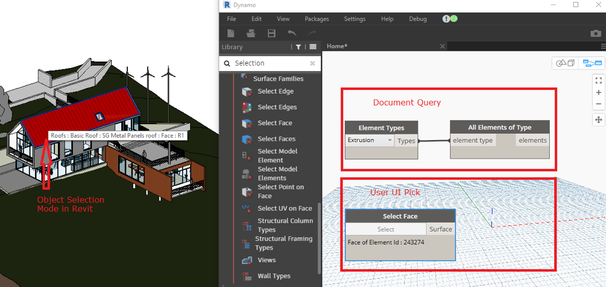
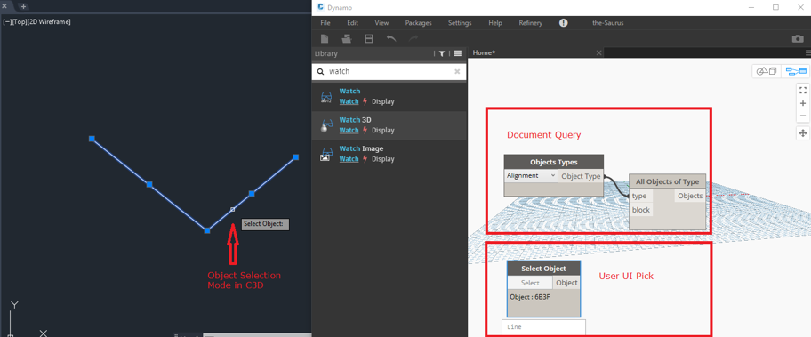
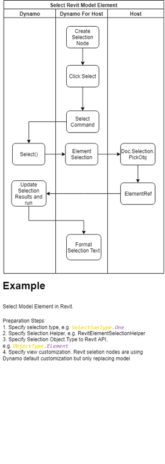
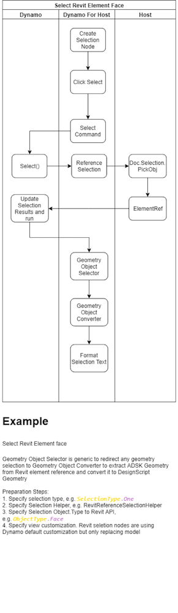
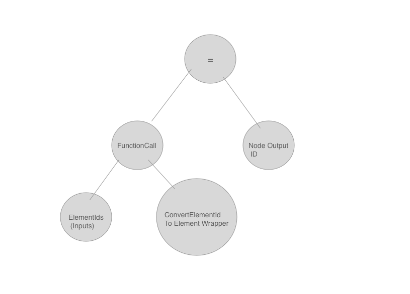

### Dynamo Revit Selection Nodes (what are they?) 

In general, these nodes let the user somehow describe a subset of the active Revit document they wish to reference. There are various ways the user might reference a Revit element (described below), and the resulting output of the node may be a Revit element wrapper (DynamoRevit wrapper) or some Dynamo geometry (Converted from Revit geometry). The difference between these output types will be useful to consider in the context of other host integrations.

At a high level, **a good way to conceptualize these nodes is as a function which accepts an element id – and returns a pointer to that element or some geometry which represents that element.** 

There are multiple `“Selection”` Nodes in DynamoRevit – We can break them into at least two groups: 

 

1. User UI pick: 

    Example `DynamoRevit` nodes in this category are `SelectModelElement`, `SelectElementFace`

    These nodes allow the user to switch into the Revit UI context and select an element or set of elements, the ids of these elements are captured, and some conversion function is run – either a wrapper is created or geometry is extracted and converted from the element. The conversion which runs depends on the type of node the user chooses. 

2. Document Query: 

    Example nodes in this category are `AllElementsOfType`, `AllElementsOfCategory`

    These nodes allow the user to query the entire document for a subset of elements – these nodes usually return wrappers which point to the underlying Revit elements. These wrappers are integral to the DynamoRevit experience allowing more advanced functionality like element binding, and allowing Dynamo integrators to pick and choose what Host APIs are exposed as nodes to the users.

### Dynamo Revit User Workflows: 

#### Example Cases 

1. 
    * User selects a Revit wall with `SelectModelElement` - A Dynamo Wall wrapper is returned into the graph (visible in the node’s preview bubble) 

    * User places the Element.Geometry node and attaches the `SelectModelElement` output to this new node – the wrapped wall’s geometry is extracted and converted to Dynamo geometry using the libG API. 

    * The user switches the graph into Automatic run mode. 

    * The user modifies the original wall in Revit. 

    * The graph is re-run automatically as the Revit document raised an event signaling some elements were updated – the selection node watches this event and see that’s the id of the element it has selected has been modified. 

### DynamoCivil User Workflows: 

The workflows in D4C is very similar to the description above for Revit, here are two typical sets of selection nodes in D4C:  

### Issues: 

* Because of the document modification updater which selection nodes in `DynamoRevit` implement – infinite loops are easy to build:
Imagine a node watching the document for all elements, and then creating new elements somewhere downstream of this node. This program, when executed, will trigger a loop. `DynamoRevit` tries to catch these case in various ways using transaction ids, and to it avoids modifying the document when inputs to element constructors have not changed.

    This needs to be considered if Automatic execution of the graph is initiated when a selected element is modified in the host application! 

* Selection nodes in `DynamoRevit` are implemented in `RevitUINodes.dll` project which references WPF – This may be a non issue – but is worth being aware of depending on your target platform. 
 

### Data Flow Diagrams

### Technical Implementation: (refer to above diagrams): 

Selection nodes are implemented by inheriting from the generic `SelectionBase` types: `SelectionBase<TSelection, TResult> ` and a minimal set of members: 

* Implementation of a `BuildOutputAST` Method – this method needs to return an AST, which will be executed at some point in the future, when the node is to be executed. In the case of Selection nodes, it should return elements or geometry from the element ids. https://github.com/DynamoDS/DynamoRevit/blob/master/src/Libraries/RevitNodesUI/Selection.cs#L280 

* Implementing `BuildOutputAST` is one of the most difficult parts of implementing `NodeModel` / UI nodes.  It is best to put as much logic as you can into a c# function, and simply embed an AST function call node into the AST. Note that here `node` is an AST node in the abstract syntax tree – not a Node in the Dynamo graph. 

* Serialization -  

  * Because these are explicit `NodeModel` derived types (not ZeroTouch) they also require implementing a [JsonConstructor] that will be used during deserialization of the node from a .dyn file. 

    The element references from the host should be saved into the .dyn file so that when a user opens a graph containing this node, their selection is still set. NodeModel nodes in Dynamo use json.net to serialize, any public properties will be serialized automatically using Json.net - use the [JsonIgnore] attribute to only serialize what is necessary. 

* Document Query nodes are a bit simpler as they do not need to store a reference to any Element IDs – see below for the `ElementQueryBase` class and derived class implementations. When executed these nodes make a call to the Revit API and query the underlying document for elements, and perform the previously mentioned conversion to either geometry or Revit element wrappers. 

### References:

#### DynamoCore base classes: 

* https://github.com/DynamoDS/Dynamo/blob/ec10f936824152e7dd7d6d019efdcda0d78a5264/src/Libraries/CoreNodeModels/Selection.cs 

* https://developer.dynamobim.org/03-Development-Options/3-5-nodemodel-derived-nodes.html
* https://developer.dynamobim.org/03-Development-Options/upgrade-nodes-for-dynamo-20.html

#### DynamoRevit: 

* https://github.com/DynamoDS/DynamoRevit/blob/master/src/Libraries/RevitNodesUI/Selection.cs 

* https://github.com/DynamoDS/DynamoRevit/blob/master/src/Libraries/RevitNodesUI/Elements.cs 