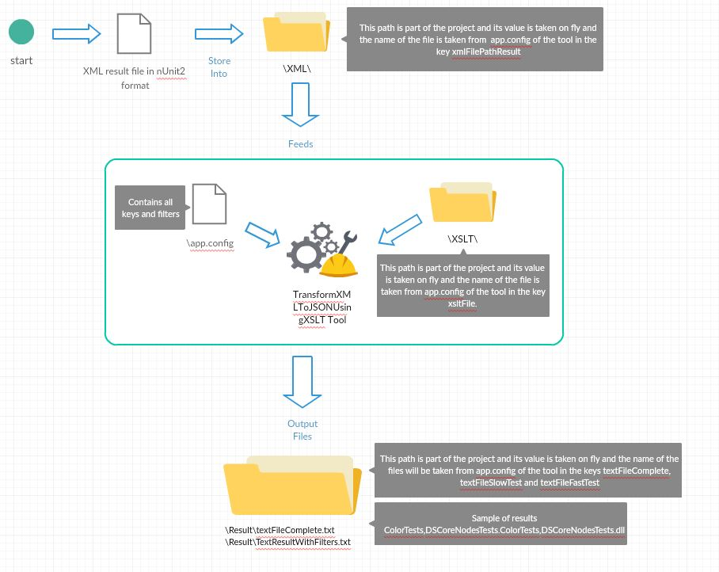

# Transformation Tool from XML in format NUnit2 to Text

Transformation Tool is an application to:.

  - Transform files XML to Text
  - Create text files
  - Configure the entry files and set the out put files.

### Technologies

 - .Net FrameWork 4.7 
 - XSLT Files to Transform.
 - C# as language

### Configuration

Transformation Tool needs the next entries to work properly, this entries have to be into app.config file and they are in two sections which are mentioned below.

**appSettings**
This section is described in the table Files needed above.
```sh
<appSettings>
    <add key="xmlFilePathResult" value="TestResult-Color_Tests.xml" />
    <add key="xsltFile" value="TransformXMLToText.xslt" />
    <add key="textFile" value="CustomTextResult.txt" />
    <add key="textFileWithFilters" value="TextResultWithFilters.txt" />
    <add key="applyFilters" value="1" /><!--1 means yes, 0 means not-->
</appSettings>
```
**About TestResult-Color_Tests.xml**
This file should be NUnit2 format and it is the result of a set of running test, there is an example below:
Note: NUnit 2 is the minimun required version.


**Command Sample:**
```
nunit3-console.exe "C:\\DSCoreNodesTests.dll" --where "test=="DSCoreNodesTests.ColorTests" and cat != Failure and cat != BackwardIncompatible" --labels=Before --explore="C:\\TestResult-Color_Tests.xml";format=nunit2
```
Where C:\\DSCoreNodesTests.dll is the DLL that contains the set of test, DSCoreNodesTests.ColorTests is the name space of the test and C:\\TestResult-Color_Tests.xml is the path and the name of the file where the result will be. This file is the result of running/explore(only NUnit3) tests so the Transformation Tool will not be the one that creates the XML file in NUnit2 format.


### Files needed
| File | Type | Description
| ------ | ------ | ------ |
| TransformXMLToText | xslt | File used to transform from XML to Text
| CustomTextResult | txt | File where results of the conversion will be
| textFileWithFilters | txt | File where results of the conversion will be but with filters 
| TestResult-Color_Tests | xml | File´s name can be different because is the file to transform and it is the result of the tests 

Note : The names of the files  can be changed if it is needed.

**Filters**
This section is the filters that will be applied in case the entry applyFilters has the value 1, in this case the slow tests are the ones that are filtered. 

```sh
<Filters>
    <add key="SerializationTests" value="SerializationTests" />
    <add key="JSONSerializationTests" value="JSONSerializationTests" />
    <add key="SerializationNonGuidIdsTest" value="SerializationNonGuidIdsTest" />
    <add key="SerializationTest" value="SerializationTest" />
    <add key="SerializationInDifferentCultureTest" value="SerializationInDifferentCultureTest" />
    <add key="RecordedTestsDSEngine" value="RecordedTestsDSEngine" />
    <add key="CoreTests" value="CoreTests" />
    <add key="RecordedTests" value="RecordedTests" />
    <add key="MigrationTestFramework" value="MigrationTestFramework" />
    <add key="Regressions" value="Regressions" />
    <add key="NodeViewCustomizationTests" value="NodeViewCustomizationTests" />
    <add key="NodeMigrationTests" value="NodeMigrationTests" />
    <add key="ComplexTests" value="ComplexTests" />
    <add key="DSEvaluationModelTest" value="DSEvaluationModelTest" />
  </Filters>
```
### Diagram of process
As a reference of the process you can see the image below.

Note : Files that are the output of the process could be used as a data source to execute fast and slow tests in CI pipeline.

**AutoDesk Dynamo Team**