# Dynamo Performance Tests

## Test Graphs

| Graph                   | Compatibility | Coverage                                                                      | Notes                                                    | 
|-------------------------|---------------|-------------------------------------------------------------------------------|----------------------------------------------------------| 
| Aniform                 | 2.x           | Coordinate Systems, Solids                                                    |                                                          | 
| CodeBlocks              | 2.x           | Code Blocks, Points, Curves                                                   |                                                          | 
| ElementBindingLarge     | 2.x           | Element Binding                                                               |                                                          | 
| HeterogenousInputsFirst | 2.x           | Heterogeneous Lists                                                           |                                                          | 
| HeterogenousInputsLast  | 2.x           | Heterogeneous Lists                                                           |                                                          | 
| HomogeneousInputs       | 2.x           | Heterogeneous Lists                                                           |                                                          | 
| ImportCSV               | 2.x           | Strings, Importing                                                            |                                                          | 
| Isovist                 | 2.x           | Vectors, Points, Curves, Solids, List Operations, List@Level, Refinery Sample |                                                          | 
| JewelCage               | 2.x           | Curves, Surfaces, List Operations, List.Map                                   |                                                          | 
| LotsOfColoredStuff      | 2.x           | Points, Curves, Solids, Lacing, Colors                                        |                                                          | 
| Math                    | 2.x           | Math, Logic, Points, Curves, Surfaces                                         |                                                          | 
| Points_40x40x40         | 2.x           | Points, Lacing                                                                |                                                          | 
| Pottery                 | 2.x           | Surfaces, Solids, Custom Node                                                 |                                                          | 
| PythonJSONParsing       | 2.1 or later  | Strings, Dictionary, JSON, Python                                             | This graph uses JSON nodes, which were introduced in 2.1 | 
| TSplinesSrf_to_Mesh     | 2.x           | Points, Meshes                                                                |                                                          | 
| Vase                    | 2.x           | Curves, Surfaces, Solids, List Operations, Map/Combine                        |                                                          | 

### Aniform
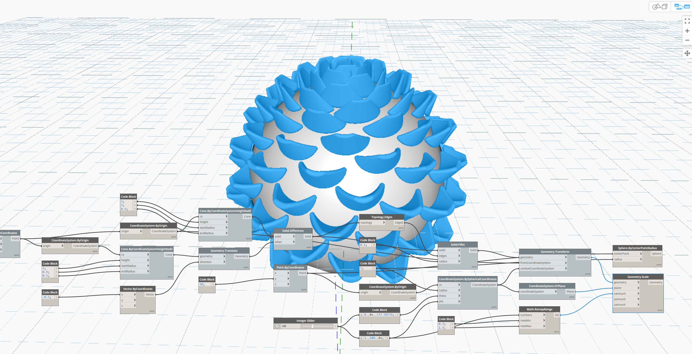

### CodeBlocks
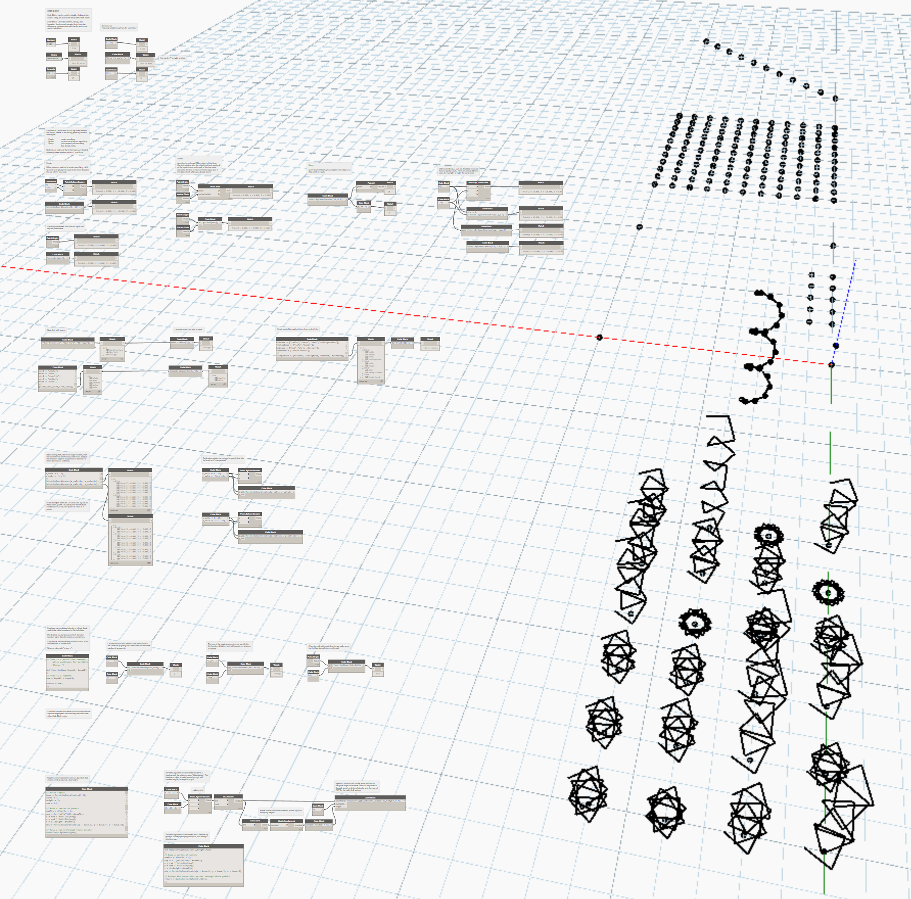

### Element Binding
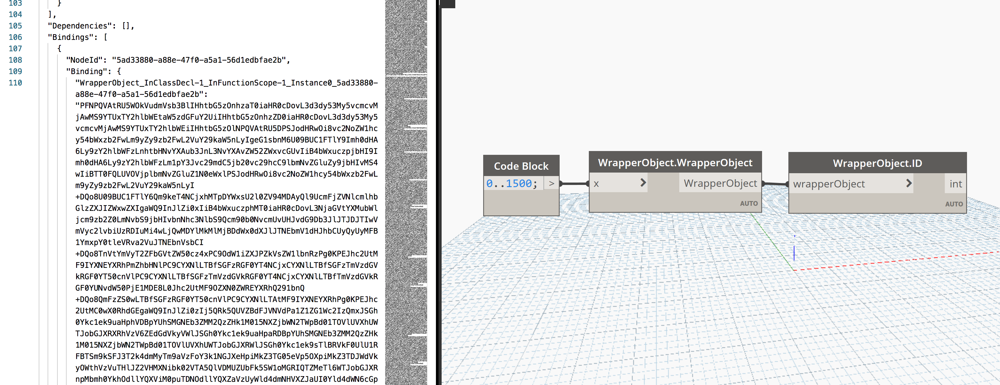

### Import csv
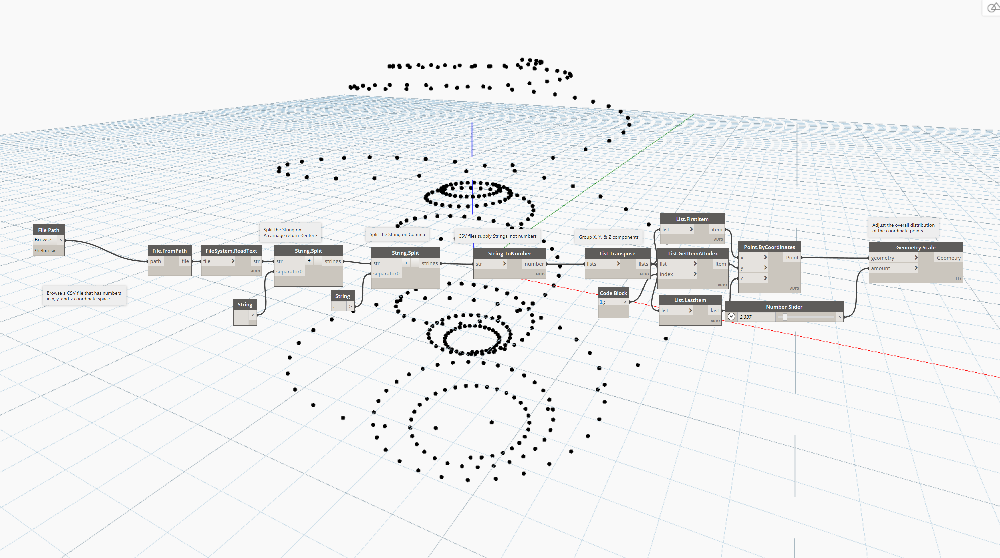

### Isovist
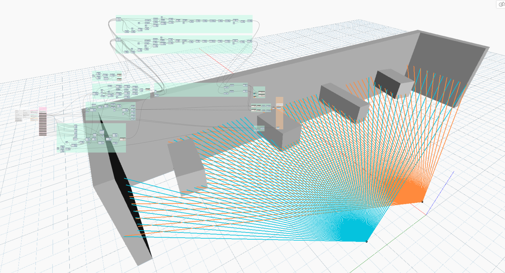

### Jewel Cage
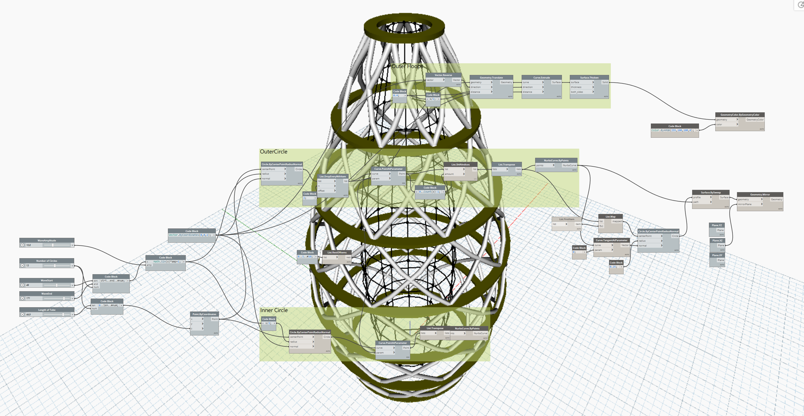

### Lots of Colored Stuff
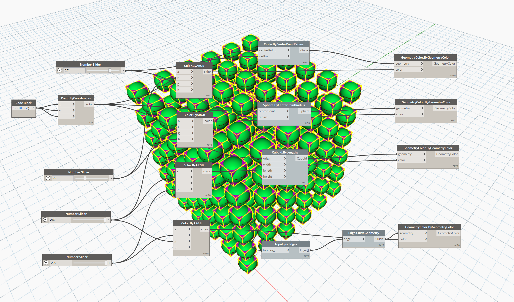

### Math
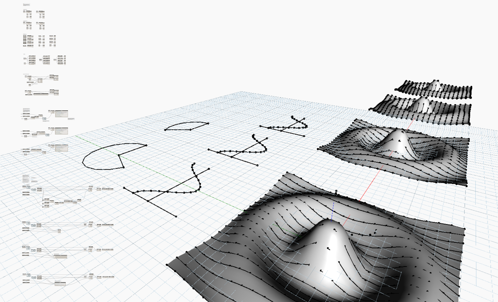

### Points
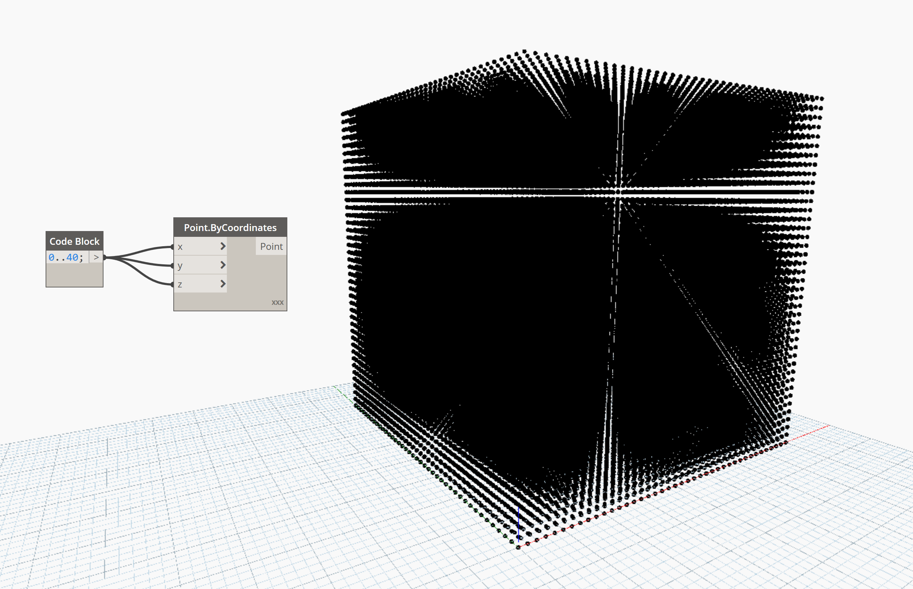

### Pottery
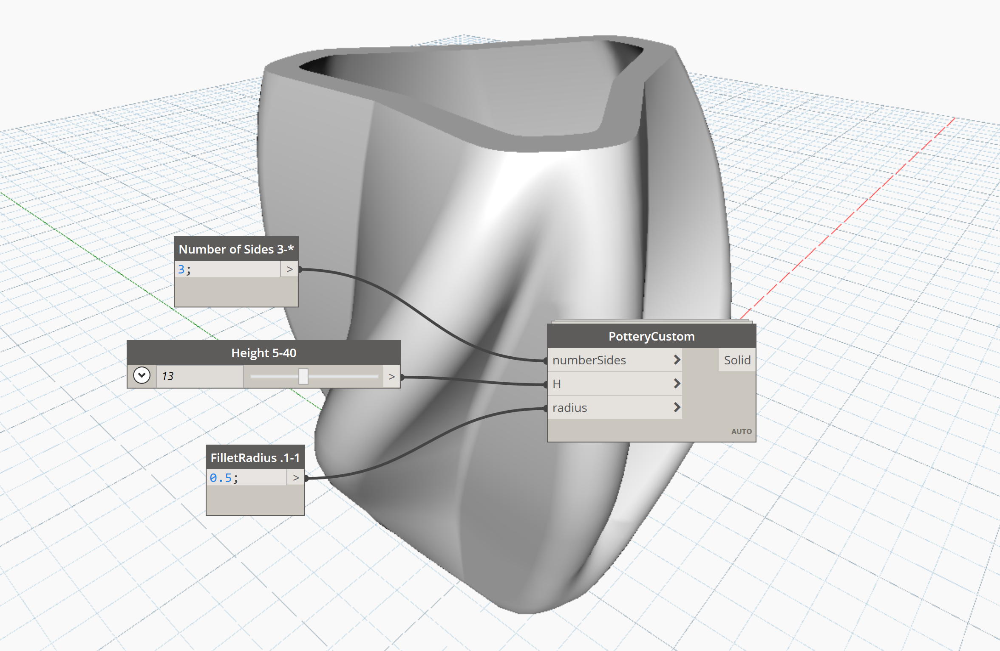

### Python JSON Parsing
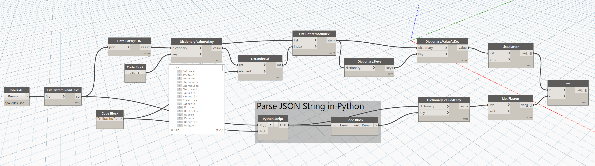

### TSplines to Mesh
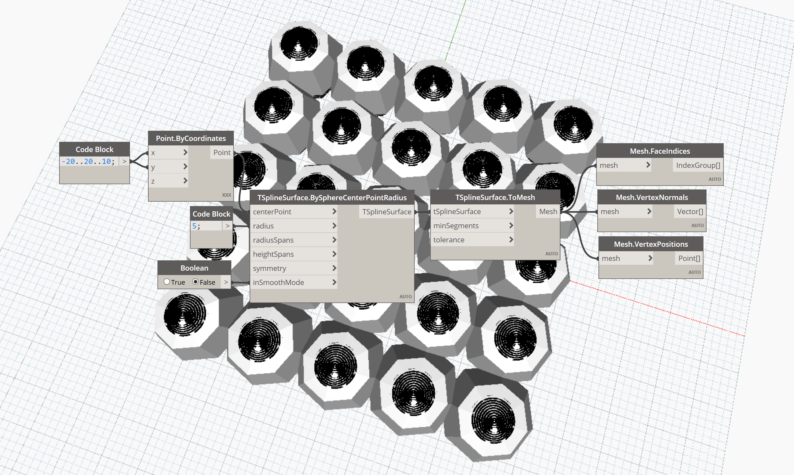

### Vase
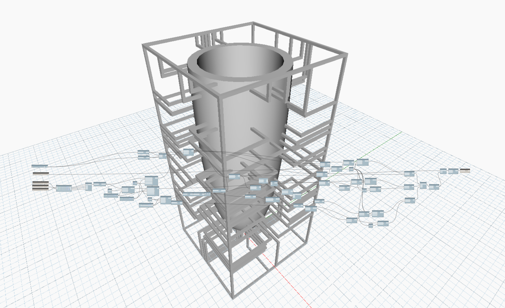
