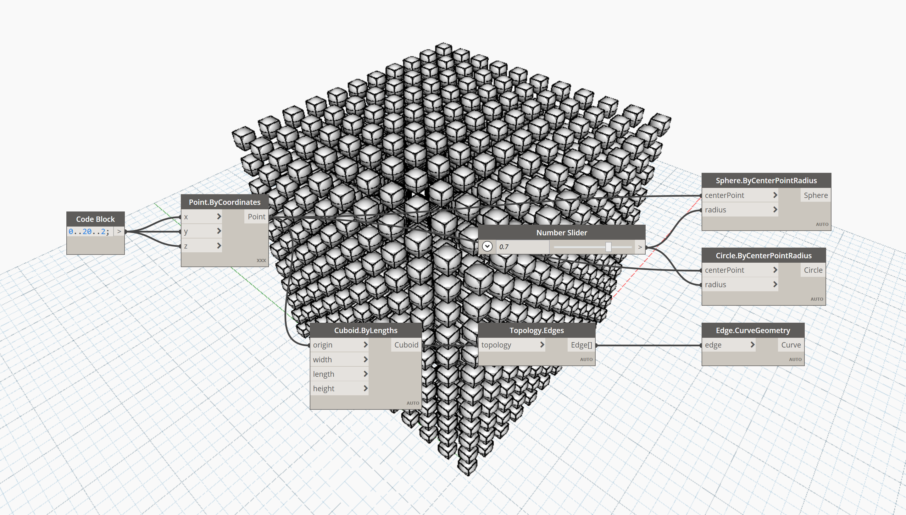
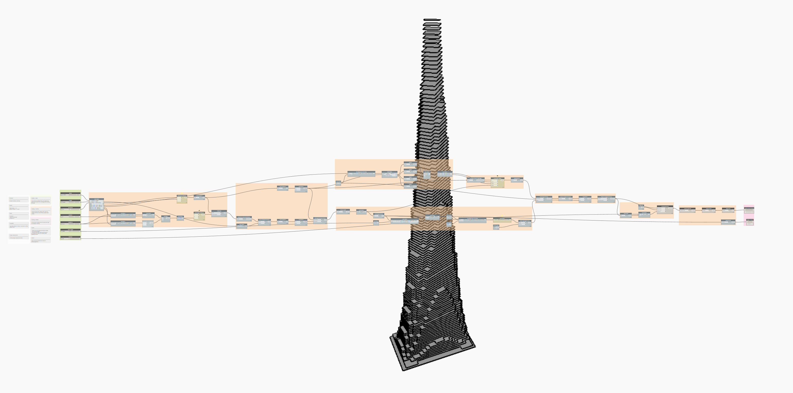

# Dynamo Performance Tests

## Test Graphs

### Jewel Cage
Curves, Surfaces, List Operations, List.Map

### Aniform
Coordinate Systems, Solids

### Lots of Stuff
Points, Curves, Solids, Lacing

### Lots of Colored Stuff
Points, Curves, Solids, Lacing, Colors

### Pottery
Surfaces, Solids, Custom Node

### Sinuous Tower
Math, Vectors, Points, Curves, Surfaces, Solids, List Operations, List.Combine, Code Blocks

### CodeBlocks
Code Blocks, Points, Curves

### CSV to Stuff
Strings, Importing

### Math
Math, Logic, Points, Curves, Surfaces

### Isovist
Vectors, Points, Curves, Solids, List Operations, List@Level, Refinery Sample

### Points
Points, Lacing

### Parse JSON
Strings, Dictionary, JSON, Python

### Vase
Curves, Surfaces, Solids, List Operations, Map/Combine

### TSplines to Mesh
Points, Meshes

